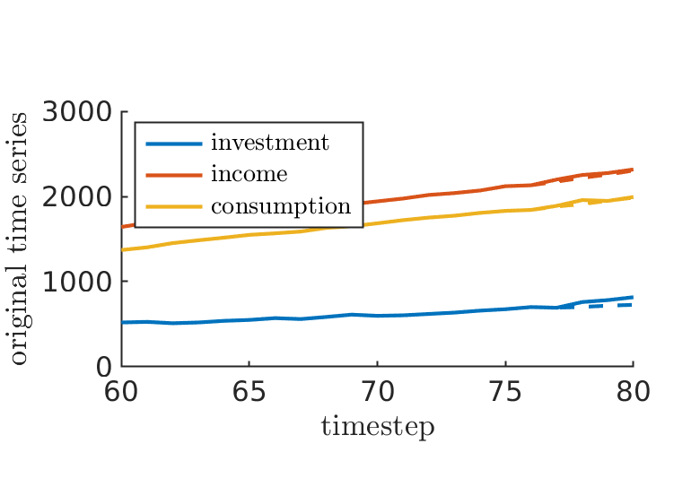
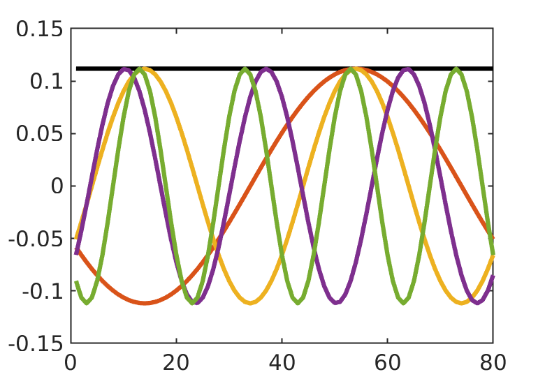

# PhD_thesis
Code to recreate figures throughout my PhD thesis.

## Introduction
This chapter contains no figures.

## Background material

## Conversions between barycentric, RKFUN, and Newton representations of rational interpolants

## The block rational Arnoldi method

## ARMA models via Krylov methods

## ABBA: adaptive brownian bridge based symbolic aggregation of time series
See <https://github.com/nla-group/ABBA>.

## Time series forecasting using LSTM networks: a symbolic approach
See <https://github.com/nla-group/ABBA-LSTMs>.

## Conclusion
This chapter contains no figures.
